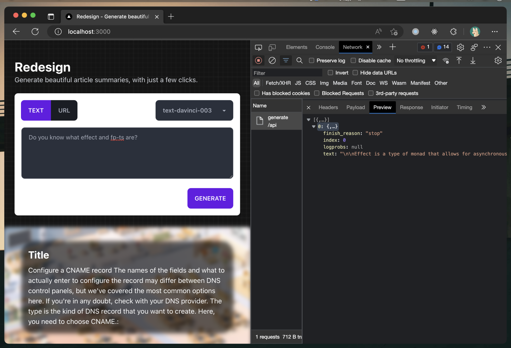

# Redesign

# Introduction

This is a very experimental project for personal purposes, the purpose is to learn how ChatGPT, Open AI use it on the front end, and learn how to use fp-ts and effect libraries to create a better product.

> 这是个人非常实验性质的项目，目的是为了学习 ChatGPT, Open AI 如何在前端使用，并学习 fp-ts 和 effect 库的使用，如何创建一个更好的产品。

Using Nx as a monorepo management tool, pnpm manages dependencies, the technology stack uses Next.js, Tauri, Vite, [fp-ts](https://github.com/fp-ts), [Effect](https://github.com/Effect-ts/effect), Tailwind, Axios, Zustand, React, React-Router

> 使用 Nx 作为 monorepo 管理工具, pnpm 管理依赖，技术栈采用 Next.js, Tauri, Vite, fp-ts, Effect, Tailwind, Axios, Zustand, React, React-Router

I am learning fp-ts and effect so I will try to use these two libraries and their ecosystem to write code and use them with React, I am not familiar with functional programming, so there may be some unreasonable places, if you have better suggestions, please feel free to raise them.

> 我正在学习 fp-ts 和 effect 所以会尽量使用这两个库和他们的生态来编写代码并和 React 一起使用，我对函数式编程并不熟练，所以可能会有一些不合理的地方，如果你有更好的建议，欢迎提出。

# Getting Started

First of all, you need to install pnpm.

```bash
npm install -g pnpm
```

## Install dependencies

```bash
pnpm install
```

## Run Web App

```bash
pnpm start web
```

## Run Tauri App

```bash
pnpm start desktop
```

## Run Browser Extension

```bash
pnpm start extension # TODO: Not implemented yet.
```

## Build the app

```bash
pnpm build # This will trigger all applications.
# or
pnpm build web
# or
pnpm build desktop
```

## Screenshots



# License

MIT
